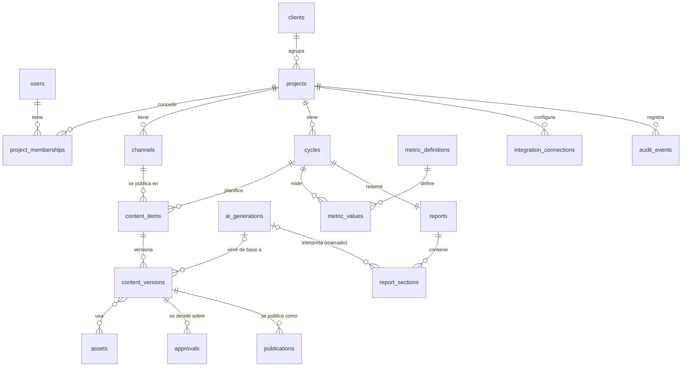

# 4. Modelo de datos relacional

## 4.1 Principios del modelo

1. **Toda tabla con datos de cliente lleva `project_id NOT NULL`.**
2. **FKs compuestas `(project_id, parent_id)`**: cada tabla padre declara `UNIQUE (project_id, id)` y las hijas referencian el par. Así la base de datos *impide* que una versión, aprobación, activo o métrica apunte a un registro de otro proyecto, aunque el código tenga un error.
3. Identificadores **UUID aleatorios** (no secuenciales) para no permitir enumeración.
4. **Inmutabilidad** donde importa la trazabilidad: `content_versions`, `approvals`, `metric_values`, `ai_generations`, `audit_events` no se actualizan; se añaden filas.
5. **Procedencia explícita**: cada dato indica su origen (`origin`, `source`).
6. Fechas en `timestamptz` (UTC); el proyecto guarda su zona horaria.

## 4.2 Diagrama



## 4.3 Tablas

Notación: `PK` clave primaria, `FK(project_id, x)` FK compuesta, `U` única.

### Identidad y acceso

**users** — `id PK`, `email U` (en minúsculas), `name`, `google_sub U` (se vincula en el primer login), `is_admin bool default false`, `is_active bool`, `created_at`, `created_by`, `last_login_at`. Esta tabla **es** la lista de permitidos: un administrador da de alta el email y solo entonces puede iniciar sesión.

**sessions** — `id PK` (SHA-256 del token; el token solo está en la cookie), `user_id FK`, `created_at`, `last_seen_at`, `expires_at`. Caducan a los 30 días o tras 8 h sin actividad; desactivar un usuario borra sus sesiones.

**project_memberships**
| Columna | Tipo | Notas |
|---------|------|-------|
| project_id | uuid FK projects | |
| user_id | uuid FK users | |
| role | enum `manager \| editor \| reviewer \| viewer` | Ver doc. 05 |
| created_at, created_by | | |
| | | `PK (project_id, user_id)` |

### Clientes, proyectos y canales

**clients** — `id PK`, `name`, `status enum active|archived`, `notes`
**projects** — `id PK`, `client_id FK`, `name`, `slug`, `timezone` (p. ej. `Europe/Madrid`), `locale`, `status enum active|archived`, `ai_enabled bool default false`, `ai_monthly_budget` (nullable). `U (id)` implícita; `U (client_id, slug)`.

**channels**
| Columna | Tipo | Notas |
|---------|------|-------|
| id | uuid PK | |
| project_id | uuid NOT NULL FK | `U (project_id, id)` |
| kind | enum `social \| email` | |
| platform | text | `instagram`, `linkedin`, `newsletter`… (catálogo configurable) |
| display_name, handle_or_list | text | Nombre visible, @usuario o nombre de lista (no la lista) |
| mode | enum `manual \| integration` | Por defecto `manual` |
| integration_connection_id | uuid nullable | `FK (project_id, integration_connection_id)` |

### Ciclo mensual

**cycles**
| Columna | Tipo | Notas |
|---------|------|-------|
| id | uuid PK | `U (project_id, id)` |
| project_id | uuid NOT NULL | |
| period | char(7) `AAAA-MM` | `U (project_id, period)` |
| status | enum `planning \| production \| review \| publishing \| reporting \| closed` | |
| objectives, key_dates, notes | text / jsonb | Brief del mes (redactado por humanos) |
| learnings | text | Al cierre |
| closed_at, closed_by | | Ciclo cerrado = solo lectura |

### Contenido

**content_items** (pieza planificada: post, reel, carrusel, story, email…)
| Columna | Tipo | Notas |
|---------|------|-------|
| id | uuid PK | `U (project_id, id)` |
| project_id | uuid NOT NULL | |
| cycle_id | uuid | `FK (project_id, cycle_id) → cycles` |
| channel_id | uuid | `FK (project_id, channel_id) → channels` |
| format | text | `post`, `carousel`, `reel`, `story`, `email`… |
| title | text | Nombre interno |
| planned_at | timestamptz nullable | |
| status | enum `idea \| draft \| in_review \| changes_requested \| approved \| scheduled \| published \| cancelled` | Derivable de versiones/aprobaciones/publicaciones; se guarda para listados y se valida en servicio |
| assignee_id | uuid FK users nullable | |

**content_versions** (inmutable)
| Columna | Tipo | Notas |
|---------|------|-------|
| id | uuid PK | `U (project_id, id)` |
| project_id | uuid NOT NULL | |
| content_item_id | uuid | `FK (project_id, content_item_id)` |
| version_no | int | `U (content_item_id, version_no)` |
| body | text | Copy del post o cuerpo del email |
| email_subject, email_preheader | text nullable | Solo emails |
| hashtags, cta, link_url | text nullable | |
| origin | enum `human \| ai_assisted` | |
| ai_generation_id | uuid nullable | `FK (project_id, ai_generation_id)`; obligatorio si `origin = ai_assisted` (CHECK) |
| created_by, created_at | | Siempre un humano |

**assets** — `id PK`, `project_id NOT NULL`, `storage_key` (`projects/{project_id}/assets/{id}`; CHECK que empiece por el prefijo del proyecto), `filename`, `mime_type`, `size_bytes`, `checksum`, `uploaded_by`, `created_at`. `U (project_id, id)`.
**content_version_assets** — `project_id`, `content_version_id`, `asset_id`, `position`. FKs compuestas a ambas tablas (los activos se ligan a la versión para que lo aprobado incluya las piezas exactas).

### Aprobaciones y publicación

**approvals** (inmutable; una fila por decisión)
| Columna | Tipo | Notas |
|---------|------|-------|
| id | uuid PK | |
| project_id | uuid NOT NULL | |
| content_version_id | uuid | `FK (project_id, content_version_id)` |
| stage | enum `internal \| client` | |
| decision | enum `approved \| changes_requested \| rejected` | |
| decided_by | uuid FK users | Usuario humano que registra |
| client_approver_name | text nullable | Si `stage = client`: quién aprobó en el cliente |
| evidence | text / asset_id nullable | Obligatoria si `stage = client` (CHECK) |
| comment | text | |
| decided_at | timestamptz | |

Regla: una versión es **publicable** si tiene `approved` en las etapas que exija el proyecto (por defecto `internal` + `client`), no tiene una decisión posterior negativa, y es la **última versión** de la pieza.

**publications**
| Columna | Tipo | Notas |
|---------|------|-------|
| id | uuid PK | |
| project_id | uuid NOT NULL | |
| content_item_id | uuid | `FK (project_id, content_item_id)` |
| content_version_id | uuid | `FK (project_id, content_version_id)` — la versión aprobada |
| method | enum `manual \| integration` | |
| provider | text nullable | Solo si `integration` |
| status | enum `scheduled \| published \| failed \| cancelled` | |
| scheduled_at, published_at | timestamptz | |
| external_id, external_url | text nullable | |
| authorized_by | uuid FK users NOT NULL | Humano que autorizó la publicación |
| created_at | | |

### Métricas (datos originales)

**metric_definitions** — catálogo global: `key PK` (p. ej. `ig.reach`, `email.open_rate`), `platform`, `label`, `unit` (`count|percent|currency|seconds`), `definition` (texto: qué mide según la plataforma), `source_doc_url`.

**metric_values** (inmutable)
| Columna | Tipo | Notas |
|---------|------|-------|
| id | uuid PK | |
| project_id | uuid NOT NULL | |
| cycle_id | uuid | `FK (project_id, cycle_id)` |
| channel_id | uuid | `FK (project_id, channel_id)` |
| content_item_id | uuid nullable | `FK (project_id, content_item_id)`; null = métrica de canal |
| metric_key | text FK metric_definitions | |
| value | numeric | |
| period_start, period_end | date | |
| source | enum `manual \| csv_import \| integration` | |
| source_ref | text | Nombre de fichero, ID de import, captura… |
| captured_by | uuid FK users nullable | Null solo si `integration` |
| captured_at | timestamptz | |
| supersedes_id | uuid nullable | Corrección: apunta a la fila que sustituye |

No hay columnas calculadas por IA aquí. Los cálculos derivados (variación mes a mes, tasas) se hacen en código determinista a partir de estas filas y se muestran como tales.

### IA (interpretaciones, separadas)

**ai_generations** (inmutable salvo `status`/`reviewed_*`)
| Columna | Tipo | Notas |
|---------|------|-------|
| id | uuid PK | `U (project_id, id)` |
| project_id | uuid NOT NULL | |
| cycle_id, content_item_id | uuid nullable | FKs compuestas |
| purpose | enum `copy_draft \| ideas \| report_interpretation \| subject_lines` | |
| provider, model | text | |
| prompt_template, prompt_template_version | text | |
| input_refs | jsonb | IDs de las filas usadas como contexto (todas del mismo proyecto) |
| output | text | Texto generado, sin editar |
| status | enum `draft \| used \| discarded` | |
| requested_by | uuid FK users | |
| reviewed_by, reviewed_at | nullable | |
| token_usage, cost_estimate | nullable | Control de gasto |

### Informes

**reports** — `id`, `project_id`, `cycle_id` (`FK (project_id, cycle_id)`, `U (project_id, cycle_id)`), `status enum draft|in_review|approved|delivered`, `approved_by`, `approved_at`, `delivered_at`.

**report_sections**
| Columna | Tipo | Notas |
|---------|------|-------|
| id | uuid PK | |
| project_id | uuid NOT NULL | |
| report_id | uuid | `FK (project_id, report_id)` |
| position | int | |
| kind | enum `data \| human_analysis \| ai_interpretation` | Se muestra visualmente distinto |
| title | text | |
| data_query | jsonb nullable | Solo `data`: qué métricas/periodo pintar (se renderiza desde `metric_values`) |
| body | text nullable | `human_analysis` o `ai_interpretation` |
| ai_generation_id | uuid nullable | Obligatorio si `kind = ai_interpretation` (CHECK) |
| reviewed_by | uuid nullable | Obligatorio para aprobar el informe si `kind = ai_interpretation` |

### Integraciones, comentarios y auditoría

**integration_connections** — `id`, `project_id`, `provider`, `status enum pending_verification|active|disabled|error`, `capabilities jsonb` (solo las verificadas, doc. 07), `scopes`, `encrypted_credentials bytea`, `verified_at`, `verified_by`. `U (project_id, id)`.

**comments** — `id`, `project_id`, `target_type enum content_item|content_version|report`, `target_id`, `body`, `author_id`, `created_at`. (FK polimórfica: se valida en servicio que el destino pertenece al mismo proyecto.)

**audit_events** (append-only; sin UPDATE/DELETE para el rol de la aplicación) — `id`, `project_id nullable` (null = acción global), `actor_id`, `action` (`content.version_created`, `approval.decided`, `publication.recorded`, `access.denied`…), `entity_type`, `entity_id`, `data jsonb`, `ip`, `created_at`.

## 4.4 Ejemplo de FK compuesta (SQL)

```sql
CREATE TABLE content_items (
  id          uuid PRIMARY KEY DEFAULT gen_random_uuid(),
  project_id  uuid NOT NULL REFERENCES projects(id),
  cycle_id    uuid NOT NULL,
  channel_id  uuid NOT NULL,
  -- …
  UNIQUE (project_id, id),
  FOREIGN KEY (project_id, cycle_id)   REFERENCES cycles   (project_id, id),
  FOREIGN KEY (project_id, channel_id) REFERENCES channels (project_id, id)
);

CREATE TABLE content_versions (
  id               uuid PRIMARY KEY DEFAULT gen_random_uuid(),
  project_id       uuid NOT NULL,
  content_item_id  uuid NOT NULL,
  origin           text NOT NULL CHECK (origin IN ('human','ai_assisted')),
  ai_generation_id uuid,
  -- …
  UNIQUE (project_id, id),
  FOREIGN KEY (project_id, content_item_id)  REFERENCES content_items  (project_id, id),
  FOREIGN KEY (project_id, ai_generation_id) REFERENCES ai_generations (project_id, id),
  CHECK (origin = 'human' OR ai_generation_id IS NOT NULL)
);
```

## 4.5 Implementado en F2 (diferencias con el diseño)

- `cycles`: `status` incluye `closed`, pero en F2 no se puede cerrar a mano (llega con el informe en F4). Un ciclo cerrado es de solo lectura.
- `content_versions`: inmutable por trigger. `origin` solo admite `human` (CHECK) hasta que exista `ai_generations` en F5; entonces se añadirá `ai_generation_id` y se relajará el CHECK.
- `assets`: `kind` = `file` (subido, con `sha256` y clave obligatoriamente bajo `projects/{project_id}/`, comprobado por CHECK) o `link` (enlace externo). Inmutable por trigger.
- `content_version_assets`: los archivos se ligan a la **versión** (no a la pieza): lo aprobado en F3 incluirá exactamente esos archivos. Inmutable.
- `comments`: sobre una pieza y ligados a la versión vigente en ese momento (`content_version_id`), con FKs compuestas en lugar de la FK polimórfica prevista.

## 4.6 Implementado en F3 (diferencias con el diseño)

- `approvals` guarda todos los hechos de revisión de una versión: `stage` = `submission` (envío a revisión), `internal` o `client`; `decision` = `submitted`, `approved` o `changes_requested` (se descarta `rejected`: para descartar una pieza se cancela). Inmutable por trigger. La respuesta del cliente exige `client_approver_name` y `evidence` (CHECK). Lleva `content_item_id` y una FK de tres columnas `(project_id, content_item_id, content_version_id)` hacia `content_versions`, así la BD garantiza que la versión es de esa pieza y de ese proyecto.
- `publications`: registro manual (`method = manual`) de lo programado o publicado, con `authorized_by`. Un trigger exige al insertar que la versión sea la última y tenga aprobación interna (y del cliente si el proyecto lo exige); otro impide cambiar pieza, versión o autor y deja `cancelled` y `published` como estados finales. Como mucho una publicación activa por pieza (índice único parcial).
- `projects` añade `require_client_approval` (por defecto sí) y `separation_of_duties` (por defecto sí).
- `content_items.status` solo usa `idea`, `draft` y `cancelled`; el resto de estados se deducen (ADR 011).

## 4.7 Endurecimiento opcional (fase posterior)

Activar **Row Level Security** de PostgreSQL en todas las tablas con `project_id`, fijando `SET LOCAL app.project_ids = …` por transacción. No se activa en el MVP para no complicar el acceso a datos, pero el modelo ya lo permite sin cambios de esquema.
